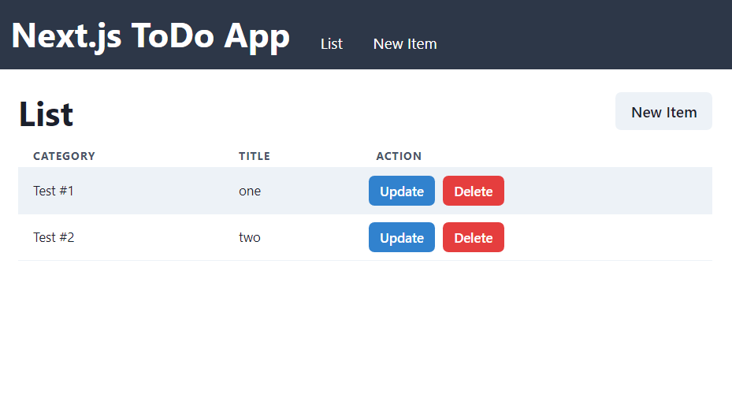

# frontend-example-next

A simple Next.js project that serves user interface for TODO web app.



## Covered Features

* Functional components with Typescript
* UI components with Chakra UI
* User and API authentication with NextAuth.js working with an OpenID Connect (OAuth 2.0) provider.

## How to start development

### Install dependencies

```shell
npm install
```

### Run the application in the development mode

```shell
npm run dev
```

### Run the application in the production mode

```shell
npm run dev
```

### Compile and minify for production

```shell
npm run build
```

### Lint and fix files

```shell
npm run lint
```
